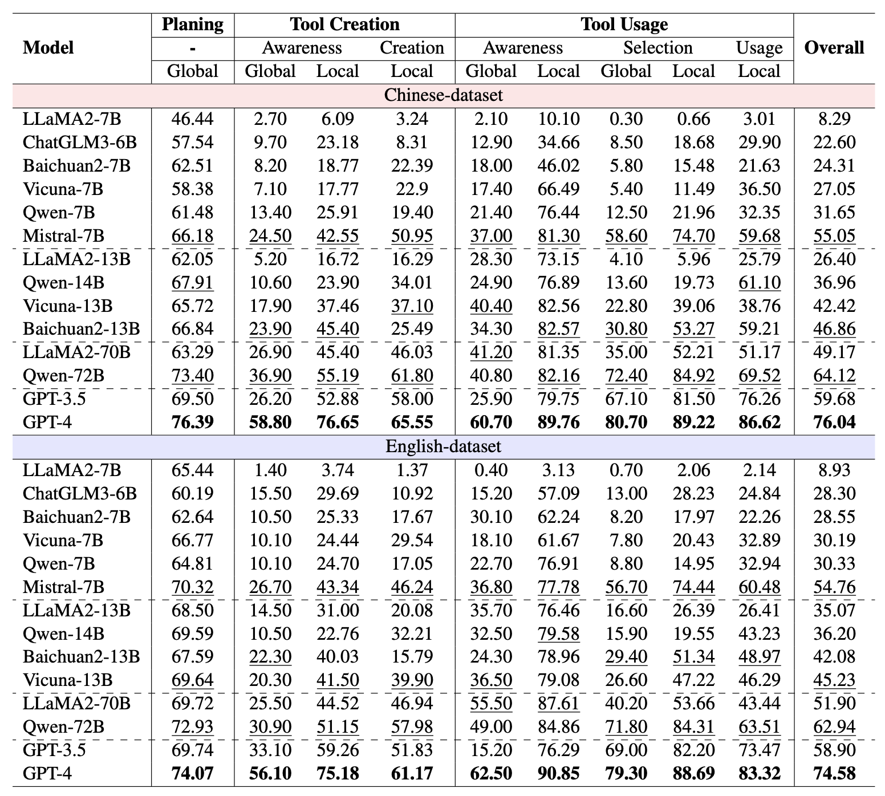

# Planning, Creation, Usage: Benchmarking LLMs for Comprehensive Tool Utilization in Real-World Complex Scenarios

## ✨Introduction

The recent trend of using Large Language Models (LLMs) as intelligent agents in real-world applications underscores the necessity for comprehensive evaluations of their capabilities, particularly in complex scenarios involving planning, creating, and using tools. However, existing benchmarks typically focus on simple synthesized queries that do not reflect real-world complexity, thereby offering limited perspectives in evaluating tool utilization. To address this issue, we present UltraTool, a novel benchmark designed to improve and evaluate LLMs' ability in tool utilization within real-world scenarios. UltraTool focuses on the entire process of using tools - from planning and creating to applying them in complex tasks. It emphasizes real-world complexities, demanding accurate, multi-step planning for effective problem-solving. A key feature of UltraTool is its independent evaluation of planning with natural language, which happens before tool usage and simplifies the task solving by mapping out the intermediate steps. Thus, unlike previous work, it eliminates the restriction of pre-defined toolset during planning. Through extensive experiments on various LLMs, we offer novel insights into the evaluation of capabilities of LLMs in tool utilization, thereby contributing a fresh perspective to this rapidly evolving field.


## 🚀What's New

- **[2024.01.31]** Release data of UltraTool, the code for evaluation is on its way.
- **[2023.01.31]** Paper available on [ArXiv](https://arxiv.org/abs/2401.17167). 

## 📈Benchmark Results



## ✏️ Citation

If you find this project useful in your research, please cite:

```
@misc{huang2024planning,
      title={Planning, Creation, Usage: Benchmarking LLMs for Comprehensive Tool Utilization in Real-World Complex Scenarios}, 
      author={Shijue Huang and Wanjun Zhong and Jianqiao Lu and Qi Zhu and Jiahui Gao and Weiwen Liu and Yutai Hou and Xingshan Zeng and Yasheng Wang and Lifeng Shang and Xin Jiang and Ruifeng Xu and Qun Liu},
      year={2024},
      eprint={2401.17167},
      archivePrefix={arXiv},
      primaryClass={cs.CL}
}
```
